# PX4飞控的校准和配置

[目录-入门指北](./README.md)

### QGC 地面站安装

通过 QGroundControl 进行 PX4 飞控的配置。

[下载QGC#download_and_install](https://docs.qgroundcontrol.com/master/en/getting_started/download_and_install.html)

按操作系统(Windows/Ubuntu)，下载对应版本。

- Ubuntu版

  1.在终端中输入下面内容，添加用户组和安装依赖包；

   ```
   sudo usermod -a -G dialout $USER
   sudo apt-get remove modemmanager -y
   sudo apt install gstreamer1.0-plugins-bad gstreamer1.0-libav gstreamer1.0-gl -y
   sudo apt install libqt5gui5 -y
   ```

  1. 注销或者重启，使用户权限的更改生效；

  2. 下载软件 QGroundControl.AppImage；

  3. 用终端给软件权限；

   ```
   chmod +x ./QGroundControl.AppImage
   ```

  4. 用终端运行/双击图标启动。

   ```
   ./QGroundControl.AppImage  (or double click)
   ```

- [注1] QGC 历史版本下载地址 
  https://github.com/mavlink/qgroundcontrol/releases/
- [注2] PX4 历史固件下载地址 
  https://github.com/PX4/PX4-Autopilot/releases


### PX4飞控固件烧录

[QGC官方教程#SetupView](https://docs.qgroundcontrol.com/master/en/SetupView/SetupView.html)

- 固件烧录

  1. 飞控通过USB口与电脑连接；

  2. 打开QGC软件；

  3. 点击左上角QGC图标，进入选择工具栏(Select Tool)，选择飞机设置(Vehicle Setup)；

  4. 进入Firmware；

     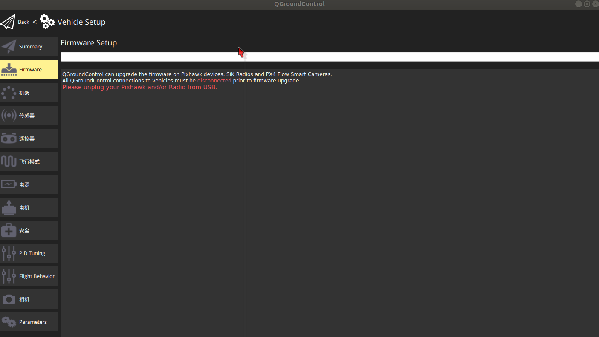

  5. 插拔USB，选择刷写的固件。默认选择官方稳定版本Standard Version（stable）。

     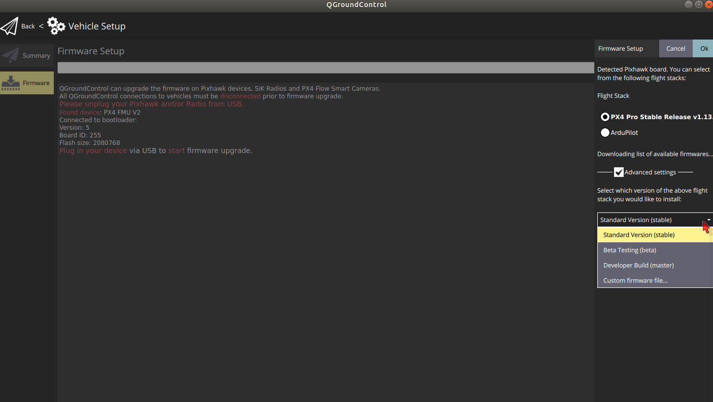


- [注1] v1.13.0固件版本后，PX4支持自动调参功能。 
  [PX4#autotune](https://docs.px4.io/main/en/config/autotune.html)

- [注2] 加载本地固件操作。

   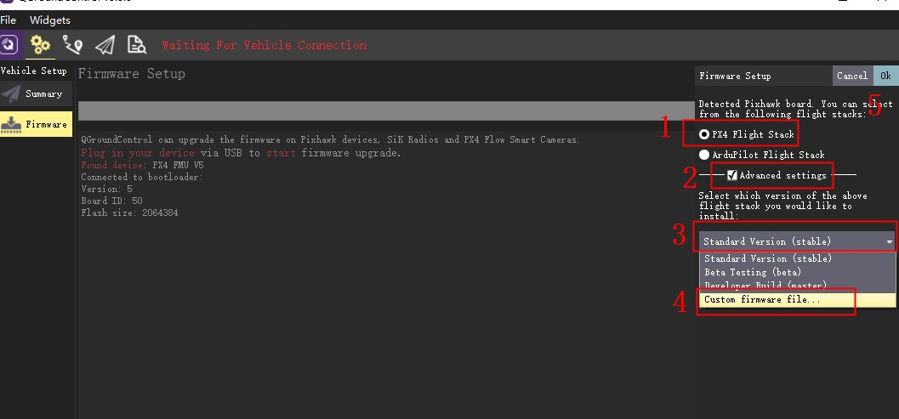


------

# PX4飞控校准

### 机型选择 Airframe

  1. 进入Airframe；
   
  2. 根据实际，选择对应机型。一般选择Generic通用机型；
   
  3. 右上角 Apply and Restart ，重启应用设置。

     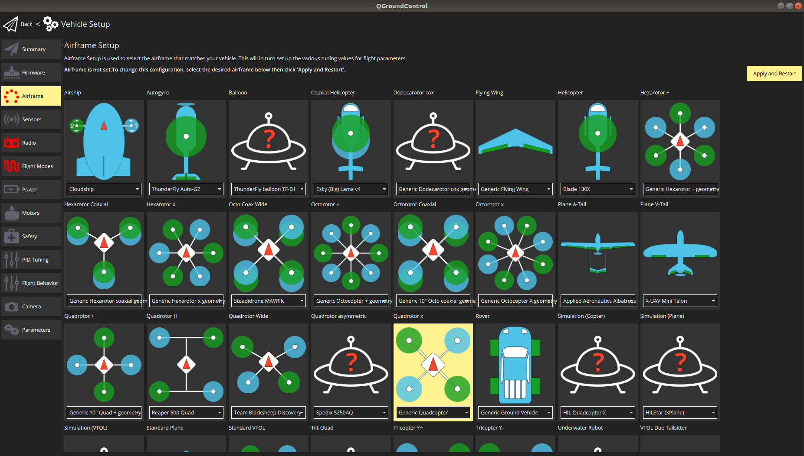


### 传感器校准 Sensors

  1. 进入Sensors；

  2. 依次点击 磁罗盘Compass、陀螺仪 Gyroscope 、加速度计 Accelerometer 和水平地平线 Level Horizon；

  3. 根据示意图，摆放/旋转飞机，完成校准；
   
      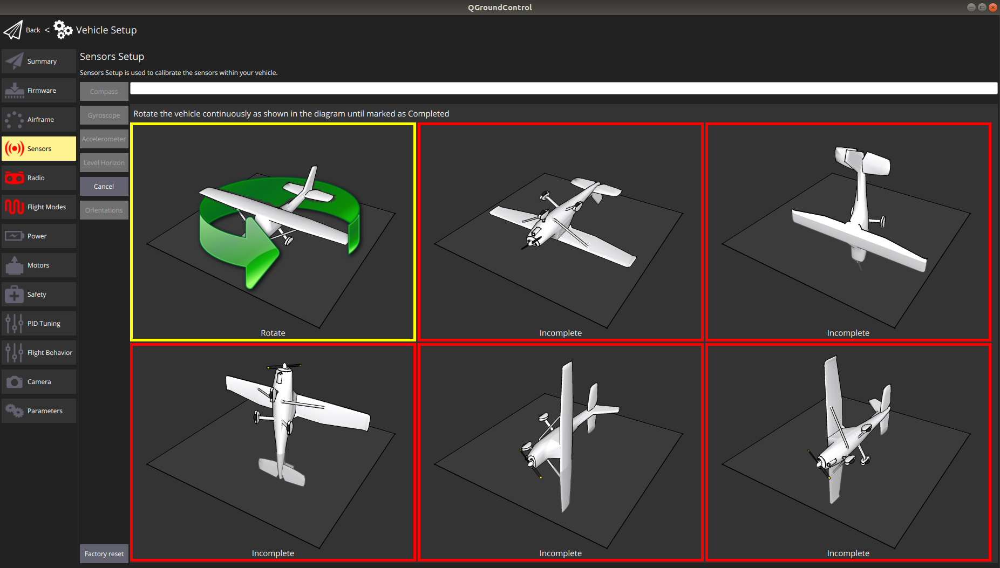

  4. [注1] GPS模块带磁罗盘，校准时需要一起。
  5. [注2] 默认飞控朝向与无人机机头对齐（ROTATION_NONE），否则需要根据两者间的关系设置方向Orientations。

     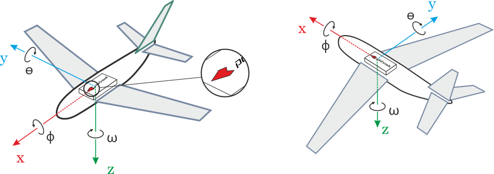

     


### 遥控器映射 Radio

  1. 进入 Radio；

  2. 根据遥控器油门，选择对应模式Mode。
     `Mode 1`为右手油门，`Mode 2` 左手油门；

  3. 点击 Calibrate，按照图示移动摇杆，完成映射。

     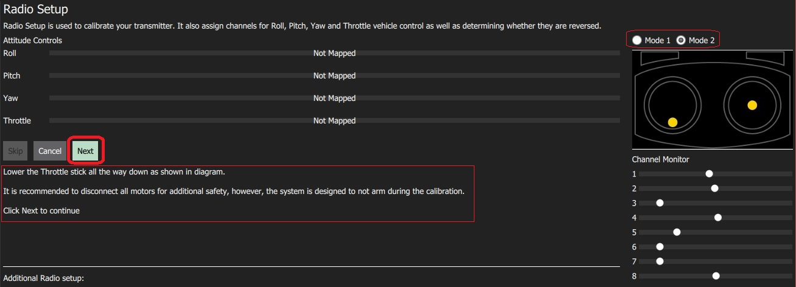

  4. [注1] 遥控器需提前与接收机配对，接收机为 S.BUS 模式。 


### 模式设置 Flight Modes

  1. 进入 Flight Modes；

  2. Flight Mode Setting 中，Mode Channel 选择遥控器某一三档拨杆对应的通道，设定模式为： Manual（手动)、Position (位置)。 可以通过遥控切换到相应模式，进行手动飞行。

  3. Swich Settings 中，需要设置三个通道： Arm switch channel(解锁开关)、Emergency Kill switch channel（紧急终止开关）和 Offboard switch channel（自主模式开关）。
      Arm switch channel(解锁开关) 用于遥控器手动飞行时，进行无人机解锁操作。
      Emergency Kill switch channel（紧急终止开关）启用时，无人机的电机将立即停转。
      Offboard switch channel（自主模式开关）用于退出无人机自主程序控制。

     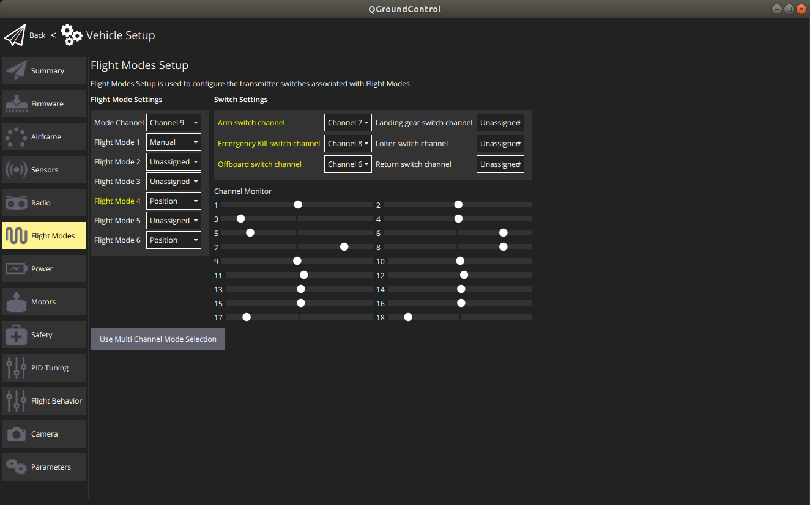

  4. [注1] 遥控器需提前与接收机配对，接收机为 `S.BUS` 模式。
   
  5. [注2] 在遥控器的`辅助通道`设置选项中，映射各开关和通道。
   
  6. [注3] Offboard模式的具体操作

     起飞前，遥控器的模式设置为 ① Position位置模式；② Offboard 打开；③ Emergency Kill关闭；④ 油门最低位。
     在允许的情况下，机载计算机会自动将飞控切换到 Offboard 模式，执行自主任务。
     当出现紧急状态，拨动遥控器 Offboard 开关，使飞控退出 Offboard 模式，进入 Position 模式。由于此时油门摇杆最低，无人机将下降，落地。

  7. 场面实在不可控，Emergency Kill，尽享一键炸鸡。


### 电源模块校准 Power

  1. 进入 Power；

  2. 根据所使用的锂电池，设置 电芯数量（Number of Cells）；4s表示由4节3.7v的锂电池串联供电。

  3. Voltage divider 电压校准，点击对应 Calibrate，输入锂电池实际的电压，计算分压比，完成校准。
 
       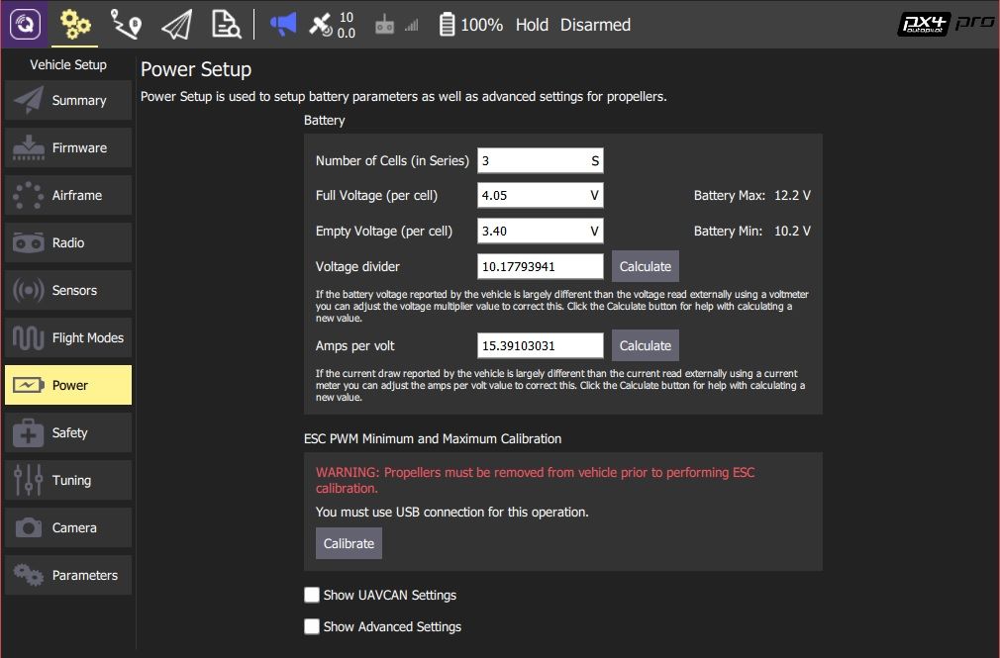

  4. [注1] 部分飞控使用CAN通信的电源模块，如 CUAV X7/NORA 飞控使用 CAN PMU Lite，此时需要设置的是 UAVCAN Settings 参数。
   
   将 `UAVCAN_ENABLE` 参数设置为 `Sensors Automatic config`；
   将 `UAVCAN_SUB_BAT` 参数设置为 `Enabled`。

      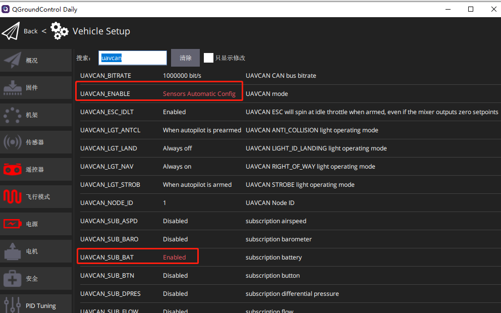


### 电调校准 ESC PWM Minimum and Maximum Calibration

  1. 进入 Power；
  2. 卸除电机上安装的桨（安全）；
  3. 在 ESC PWM Minimum and Maximum Calibration 中，点击校准；
  4. 插入电池，给无人机供电。

       

  5. 注: 对于使用 DShot 协议的电调，需要在配置里设置DShot参数。
    
      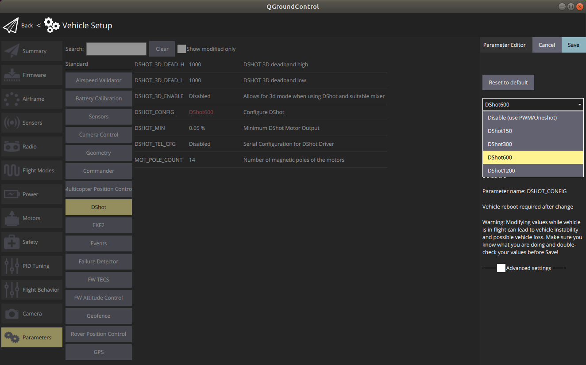

  6. 注: DShot 协议电调，需要设置某电机转向反向。
   
      ```
      dshot reverse -m 1
      dshot save -m 1
      ```  

      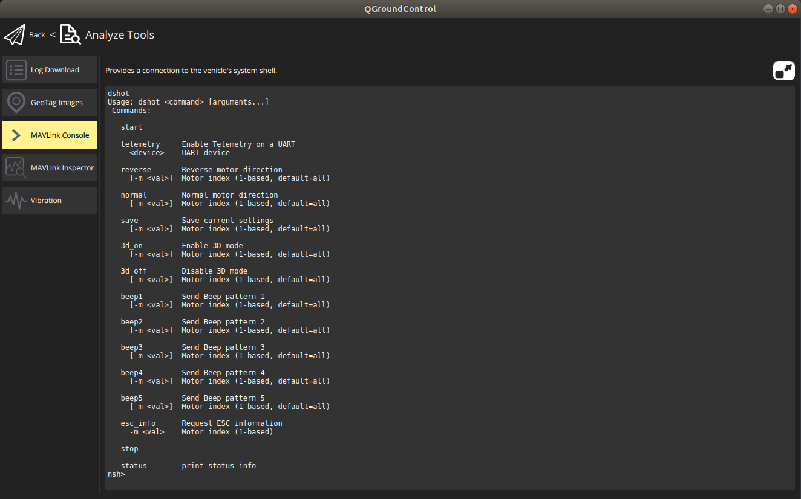


### 参数设置 Parameters

  1. 进入 Parameters；
   
  2. 开启 `TELEM 2`，用于连接机载计算机 (MAVROS)。
   
     设置 `MAV_1_CONFIG` 为 `TELEM2`，重启飞控；
     确认对应的 `SER_REL2_BAUD` 为 `921600 8N1`。

      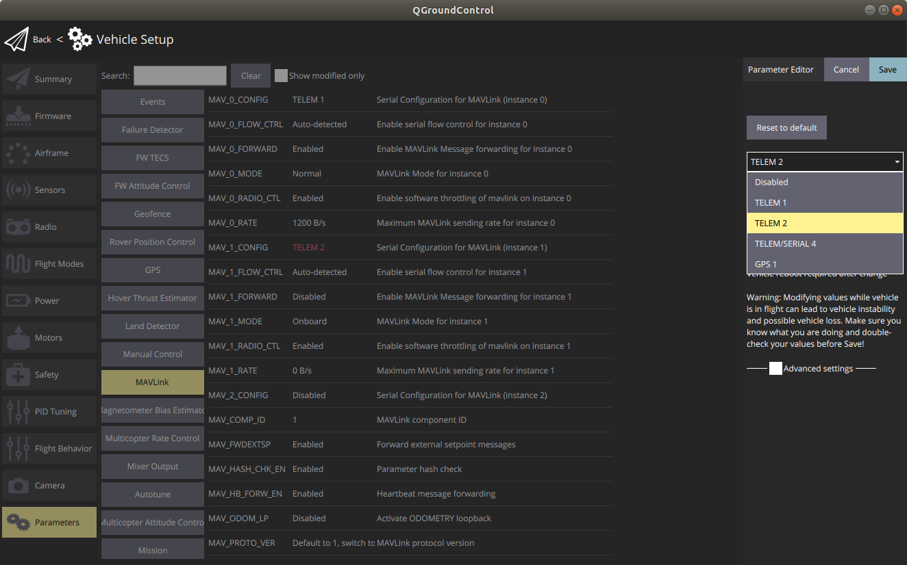
      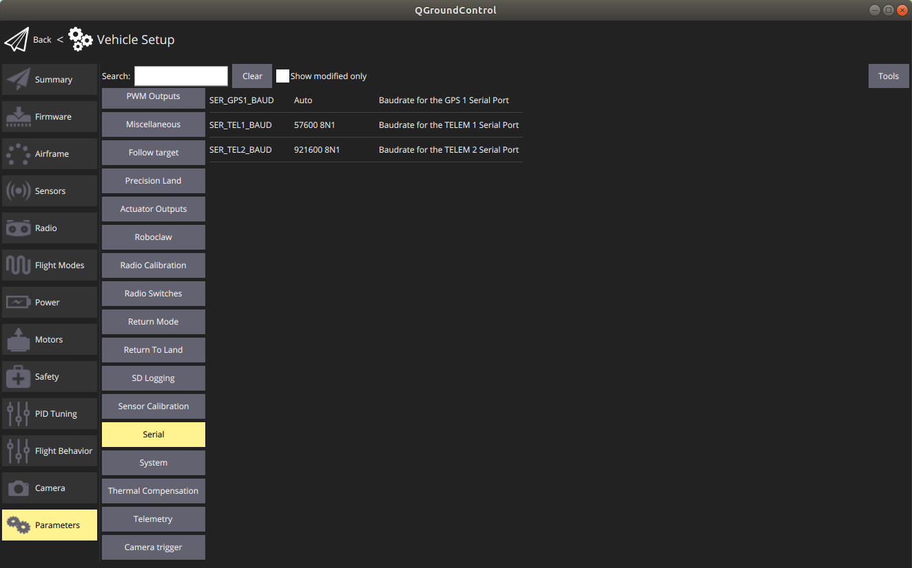

  3. 室内环境下，使用外部定位设备提供无人机的位姿信息时：
     设置 `EKF2_AID_MASK` 和 `EKF2_HGT_MODE`。

     [PX4#Using Vision or Motion Capture Systems for Position Estimation](https://docs.px4.io/main/en/ros/external_position_estimation.html)

      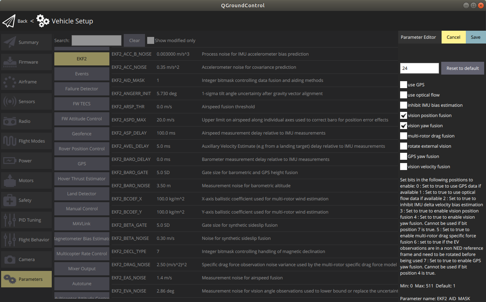
      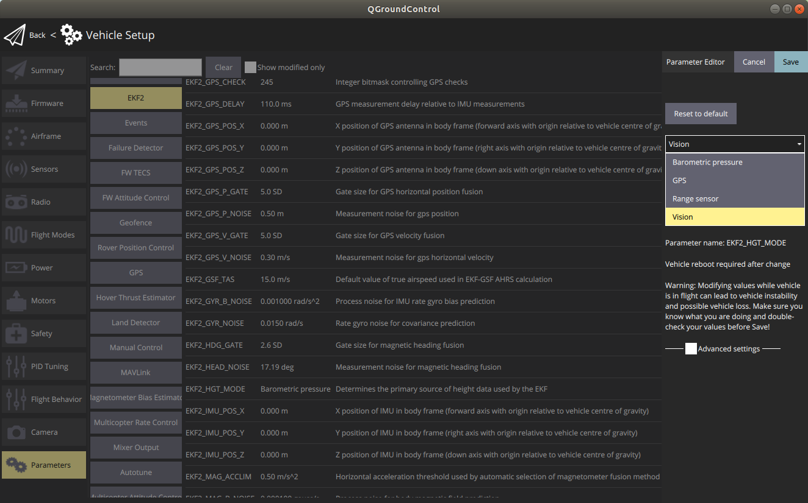

  4. 修改 MAVLink 部分数据的发布频率(飞控上电自动)：
   
     [MAVLink.html#set-streaming-rate](https://docs.px4.io/main/en/middleware/mavlink.html#set-streaming-rate)

     
     在飞控的sd卡的根目录下创建/etc/extras.txt，写入

   ```
      mavlink stream -d /dev/ttyS3 -s ATTITUDE_QUATERNION -r 200
      mavlink stream -d /dev/ttyS3 -s HIGHRES_IMU -r 200
   ```
   
   [注1] 不同飞控的 serial-port-mapping 可能不同，需要根据飞控手册设置相对应的 /dev/tty? ，和 MAV_1_CONFIG 。
   [px4#serial_port_mapping](https://docs.px4.io/main/en/hardware/serial_port_mapping.htm)

   举例 pixhawk4_mini 的映射关系。 [pixhawk4_mini.html#serial-port-mapping](https://docs.px4.io/main/en/flight_controller/pixhawk4_mini.html#serial-port-mapping)
   `MAV_1_CONFIG` 设置为 `TELEM/SERIAL4`, 对应 `/dev/ttyS3`。
   若使用USB连接计算机和飞控，则 `/dev/ttyACM0`。

   [注2] 也可以在 `MAVLink Console` 中使用 `mavlink status`来大致判断。
         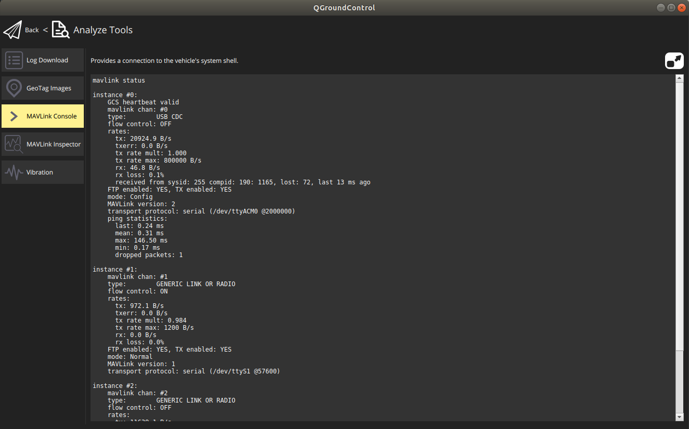
   