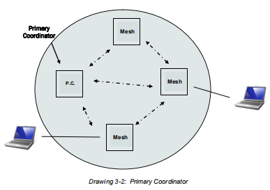
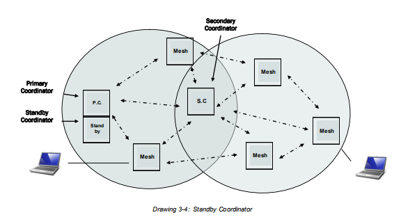

# P900 模块配置

[目录-入门指北](./README.md)

### 参考资料文档

1. 快速参考
    [Microhard P900技术支持-www.isnmp.com/microhard-p900-support/](www.isnmp.com/microhard-p900-support/)

2. 官方手册 
    Microhadr P900 官网芯片手册 [P900_Manual.v1.8.7.pdf]

    [奶牛快传/cowtransfer.com](https://cowtransfer.com/s/24516ab13b4245)    **传输口令** `xu7nls`

### 快速配置 (Mesh模式-未使用中转/其他配置)

Mesh 模式说明，任意模块间皆可以通信。
最简单的模式如图`Drawing3-2`所示，暂不考虑更复杂的模式如何设置（如中转`Drawing3-4`）。

|模块类型| 数量| 说明|
|--- |--- |--- |
|主模块（primary coordinator） | 单独×1 | 同步用 |
|从模块（Mesh） |	N | 无人机/地面站 |

  

  

1. 使模块进入配置模式；
2. 任意串口助手，波特率=9600，打开待配置模块端口。
3. 依次输入下列配置指令 `AT???`。

- [快速配置 - 主]
  ```
  AT&F1
  ATS102=1
  ATS103=1
  ATS104=2365478
  ATS153=1

  ATS113=0
  ATS219=2

  AT&WA	
  ```

- [快速配置 - 从]
  ```
  AT&F2
  ATS102=1
  ATS103=1
  ATS104=2365478
  ATS153=1

  ATS113=0
  ATS219=2
	
  AT&WA
  ```

### 已配置Mesh从模块的MAC地址和标签备份 (Mesh模式)
[组网模块 MAC]

ATF2-1
[18:20:04:015] MAC: 00:F0:49:00:AA:AF␍␊

ATF2-2
[18:30:50:820] MAC: 00:F0:49:00:AC:E3␍␊

ATF2-3
[18:28:41:815] MAC: 00:F0:49:00:AB:DE␍␊

ATF2-4
[18:37:54:069] MAC: 00:F0:49:00:AC:96␍␊

### 完整配置输出

- [组网模块-从/Mesh] 完整配置参数参考
```
[18:20:03:926] p900␍␊
[18:20:03:926] 900MHz Mesh Radio Microhard Systems, Inc.␍␊
[18:20:03:967] v1.33 build 1.2232 Sep 27 2017 11:50:19␍␊
[18:20:04:015] MAC: 00:F0:49:00:AA:AF␍␊

[18:20:04:031] E1  Q0  DCD &C1  DTR &D0  Handshaking &K0  DSR &S1␍␊
[18:20:04:095] Destination Address    S140=FF:FF:FF:FF:FF:FF␍␊
[18:20:04:143] Tx Profile             S80=0            CS threshold           S81=20␍␊
[18:20:04:207] Reverse RSSI leds      S88=0            Operating Mode         S101=2␍␊
[18:20:04:287] Serial Baud Rate       S102=1           Wireless Link Rate     S103=1␍␊
[18:20:04:367] Network Address        S104=2365478     Hop Pattern            S106=0␍␊
[18:20:04:431] Hop Zone               S180=0           Output Power(dBm)      S108=30␍␊
[18:20:04:511] Data Format            S110=1           Packet Min Size        S111=1␍␊
[18:20:04:591] Packet Max Size        S112=256         Packet Retransmissions S113=0␍␊
[18:20:04:655] Repeat Interval        S115=5           Character Timeout      S116=10␍␊
[18:20:04:735] Average RSSI(dBm)      S123=N/A         Attempts b4 re-route   S126=9␍␊
[18:20:04:814] Network Type           S133=2           Serial Channel Mode    S142=0␍␊
[18:20:04:879] Sleep mode             S143=0           Address Tag            S153=1␍␊
[18:20:04:959] FEC Mode               S158=7           Num of aloha slots     S214=60␍␊
[18:20:05:022] Num of mesh sync slots S215=1           Protocol Type          S217=0␍␊
[18:20:05:102] Input Framing          S218=0           Routing Request TTL    S219=2␍␊
[18:20:05:182] Mesh Roaming Mode      S222=1           Routing                S223=0␍␊
[18:20:05:246] Standby trip level     S224=20          Ch Access Mode         S244=1␍␊
[18:20:05:326] Cost of hop in mesh    S245=100␍␊
```


- [组网模块-主/primary_coordinator] 完整配置参数参考

```
[18:21:21:284] p900␍␊
[18:21:21:299] 900MHz Mesh Radio Microhard Systems, Inc.␍␊
[18:21:21:347] v1.33 build 1.2232 Sep 27 2017 11:50:19␍␊
[18:21:21:379] MAC: 00:F0:49:00:AA:86␍␊

[18:21:21:411] E1  Q0  DCD &C1  DTR &D0  Handshaking &K0  DSR &S1␍␊
[18:21:21:459] Destination Address    S140=FF:FF:FF:FF:FF:FF␍␊
[18:21:21:507] Tx Profile             S80=0            CS threshold           S81=20␍␊
[18:21:21:587] Reverse RSSI leds      S88=0            Operating Mode         S101=4␍␊
[18:21:21:667] Serial Baud Rate       S102=1           Wireless Link Rate     S103=1␍␊
[18:21:21:731] Network Address        S104=2365478     Hop Pattern            S106=0␍␊
[18:21:21:811] Hop Zone               S180=0           Output Power(dBm)      S108=30␍␊
[18:21:21:891] Data Format            S110=1           Packet Min Size        S111=1␍␊
[18:21:21:955] Packet Max Size        S112=256         Packet Retransmissions S113=0␍␊
[18:21:22:035] Repeat Interval        S115=5           Character Timeout      S116=10␍␊
[18:21:22:114] Average RSSI(dBm)      S123=N/A         Attempts b4 re-route   S126=9␍␊
[18:21:22:179] Network Type           S133=2           Serial Channel Mode    S142=0␍␊
[18:21:22:258] Address Tag            S153=0           FEC Mode               S158=7␍␊
[18:21:22:322] Num of aloha slots     S214=60          Num of mesh sync slots S215=1␍␊
[18:21:22:402] Mesh sync duty cycle   S216=9           Protocol Type          S217=0␍␊
[18:21:22:483] Input Framing          S218=0           Routing Request TTL    S219=2␍␊
[18:21:22:546] Routing                S223=0           Standby trip level     S224=20␍␊
[18:21:22:626] Ch Access Mode         S244=1           Cost of hop in mesh    S245=100␍␊
[18:21:22:706] Sync timeout           S248=100␍␊
```


