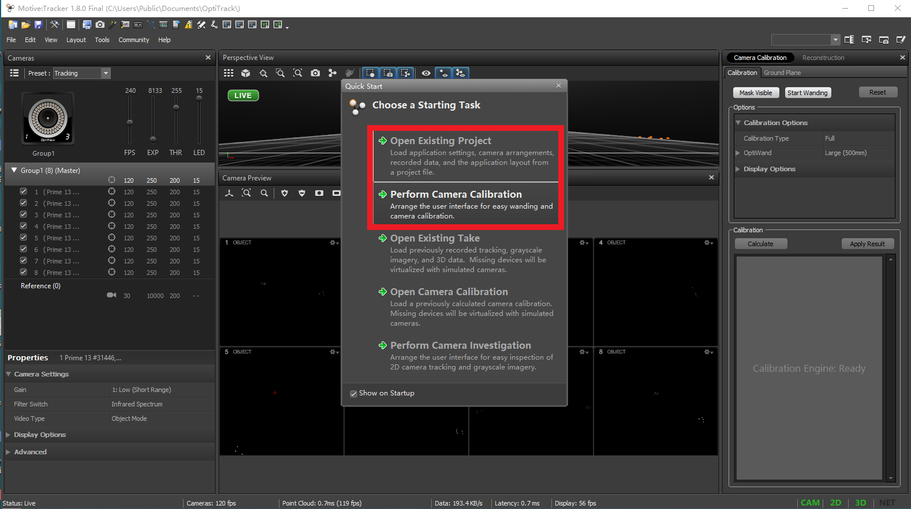
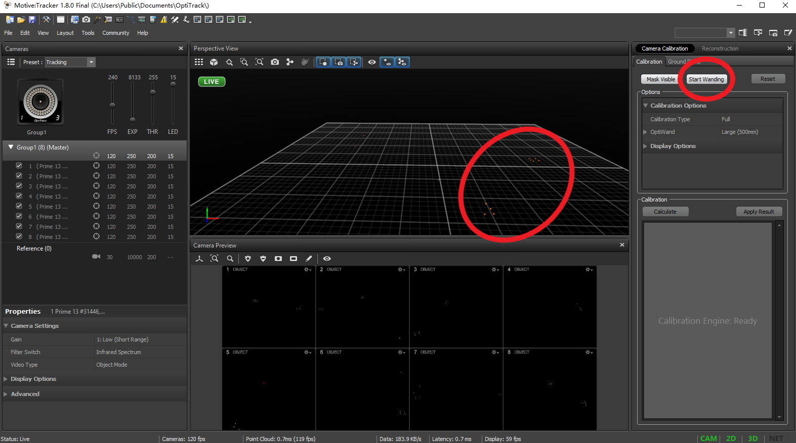
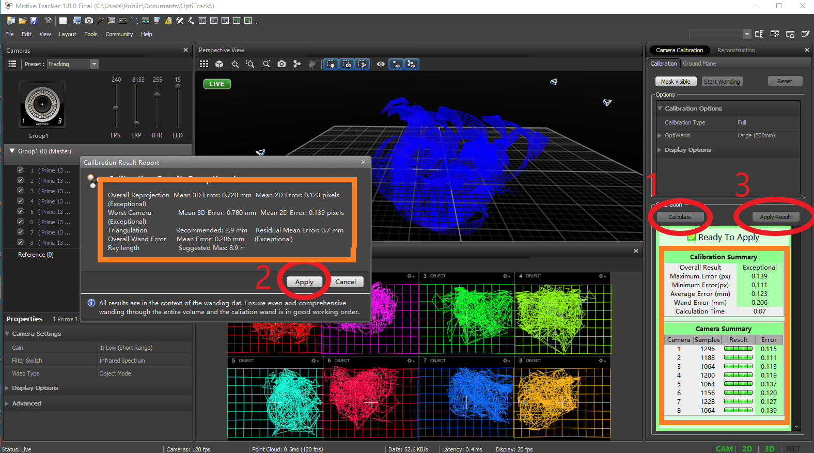
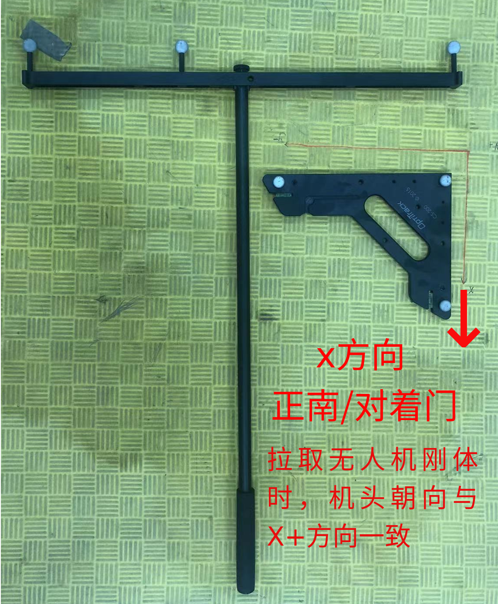
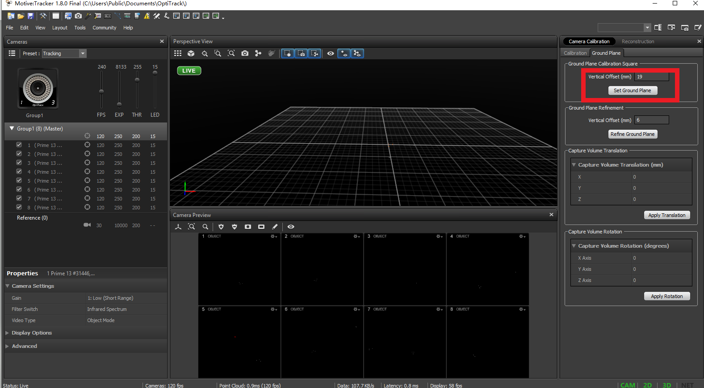
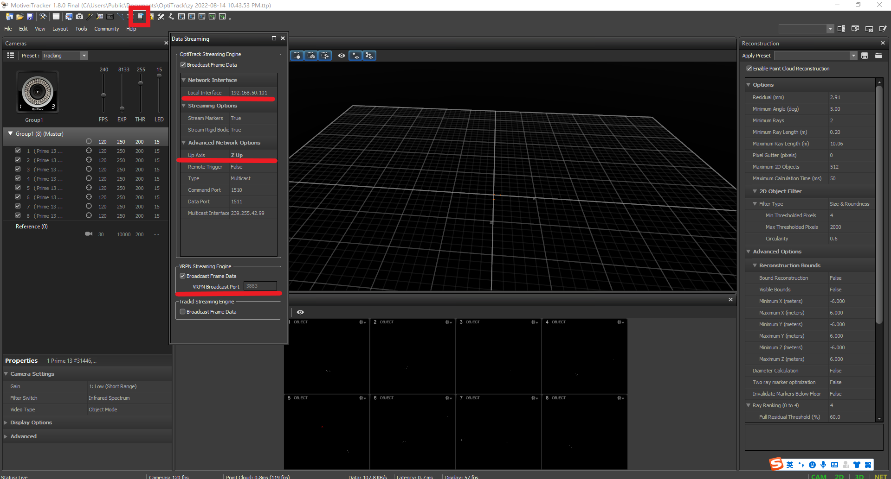
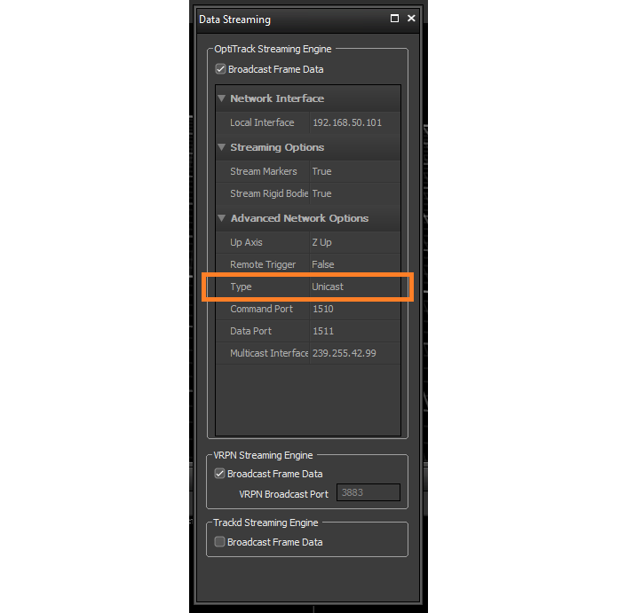
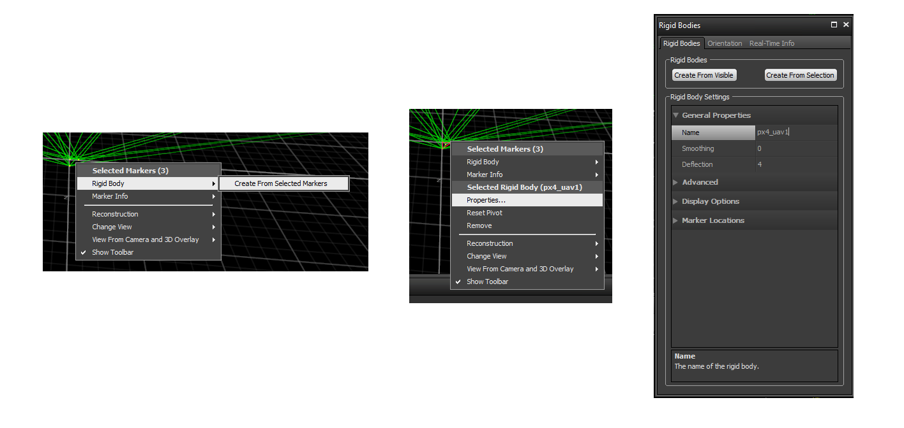
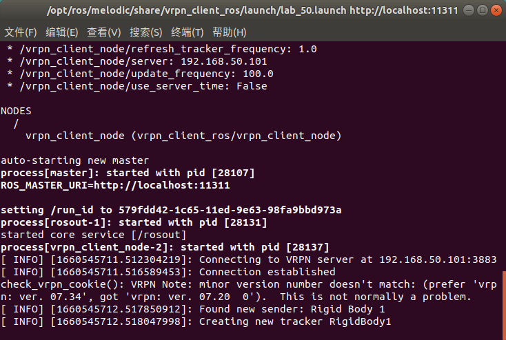

# OptiTrack 室内定位系统 + vrpn_client_ros

[目录-入门指北](./README.md)


### Motive 标定

  1. 打开　`Motive` 软件，①选择之前的项目　或　②新建标定。
  长时间不用，请标定新的。
  .ttp 项目Project
  .cal 相机标定文件

  

  1. 选择②新建相机标定，确保视野内　无标记点＆反光点　后，开始标定。
  　　移动标定杆，此时相机进入标定模式，蓝色表示此时标记杆的位置，绿色表示已有数据，确保每个相机都是绿色的。

  

  3. 点击计算，根据标定结果，确定能否要应用。
   如果计算结果差，重复第二步。

  

  ４. 场地内摆放三角板，确定原点O和xyz三轴。

  

  

  5. 标定完成，记得保存。

### Motive 设置

  1. 开启数据流传输
   
  - IP：地面站在局域网中的IP (192.168.50.101)

  - 向上为 Z轴正方向，系统默认是Y轴

  - 开启 VRPN

  

  2. [注] 对 `Crazyswarm` ，使用 `Single Marker` + `libobjecttracker` 时。
    
  待验证
    
  ```
    # ros_ws/src/crazyswarm/launch/hover_swarm.launch

    # tracking
    motion_capture_type: "optitrack_closed_source" # one of none,vicon,optitrack,optitrack_closed_source,qualisys,vrpn
    object_tracking_type: "libobjecttracker" # one of motionCapture,libobjecttracker
    send_position_only: False # set to False to send position+orientation; set to True to send position only
    motion_capture_host_name: "192.168.50.101"
    motion_capture_interface_ip: "239.255.42.99" # optional for optitrack with multiple interfaces
  ```

  


### 拉取无人机刚体

  1. 注意机头朝向，与定位系统x轴正方向一致。
   
  

### 无人机位置的获取 vrpn_client_ros

  1. 安装 vrpn_client_ros 包

  ```
  sudo apt install ros-melodic-vrpn-client-ros -y
  ```

  也可 git clone 本地编译，需要安装VRPN

  ```
  sudo apt install ros-melodic-vrpn -y
  git clone https://github.com/ros-drivers/vrpn_client_ros.git
  ```

  2. 修改 launch 文件

  ```
  roscd vrpn_client_ros
  cd launch
  sudo gedit sample.launch
  ```


  ```
    - <arg name="server" default="localhost"/>
    + <arg name="server" default="192.168.50.101"/>
  ```

  `localhost`为地面站对应IP `192.168.50.101`


  3. 启动 launch 
  
  ```
    roslaunch vrpn_client_ros sample.launch
  ```

  